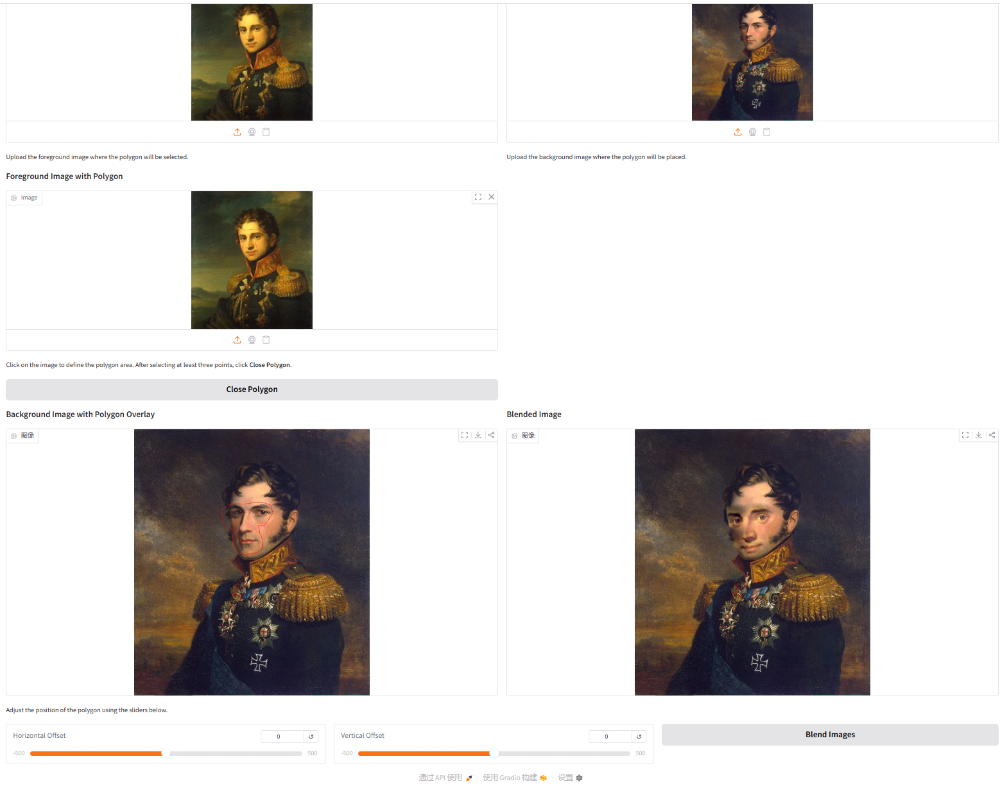
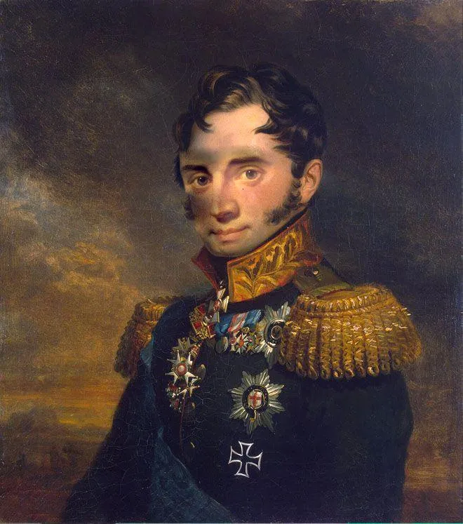
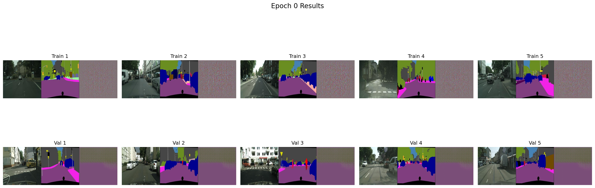
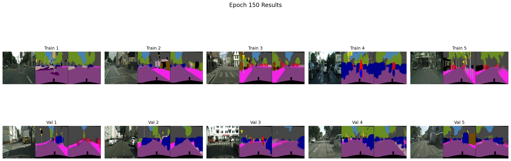
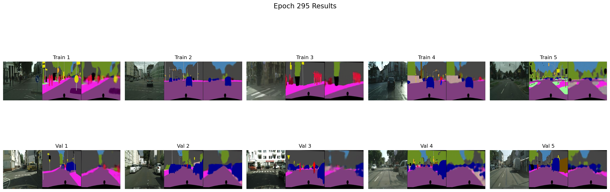

# Assignment 2 - DIP with PyTorch

## This repository is HeJiaxuan's implementation of Assignment_02 of DIP.

---

### 1. Implement Poisson Image Editing with PyTorch.
## Running

To run Poisson Image Editing, run:

```basic
python run_blending_gradio.py
```

## Results 




---

### 2. Pix2Pix implementation.
## Running
Run:
```bash
bash download_cityscapes_dataset.sh
python train.py
```

The code will train the model on the [Cityscapes Dataset](http://efrosgans.eecs.berkeley.edu/pix2pix/datasets/cityscapes.tar.gz).

## Results 
The results are in train_results and val_results. Here are the visualization of comparison.
epoch = 0


epoch = 150


epoch = 295


The gif


---

### Requirements:
To install requirements:

```setup
python -m pip install -r requirements.txt
```

