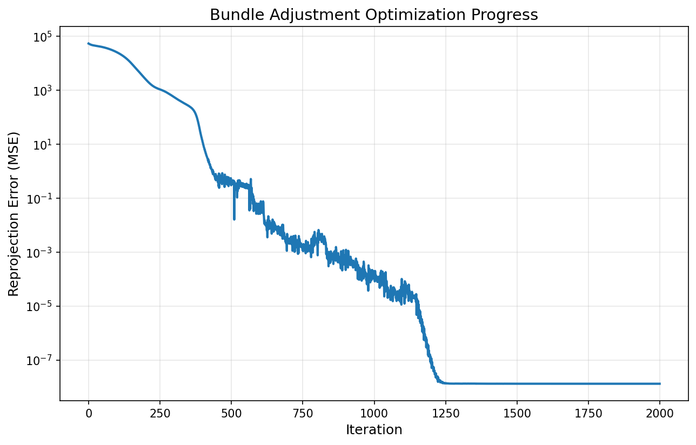
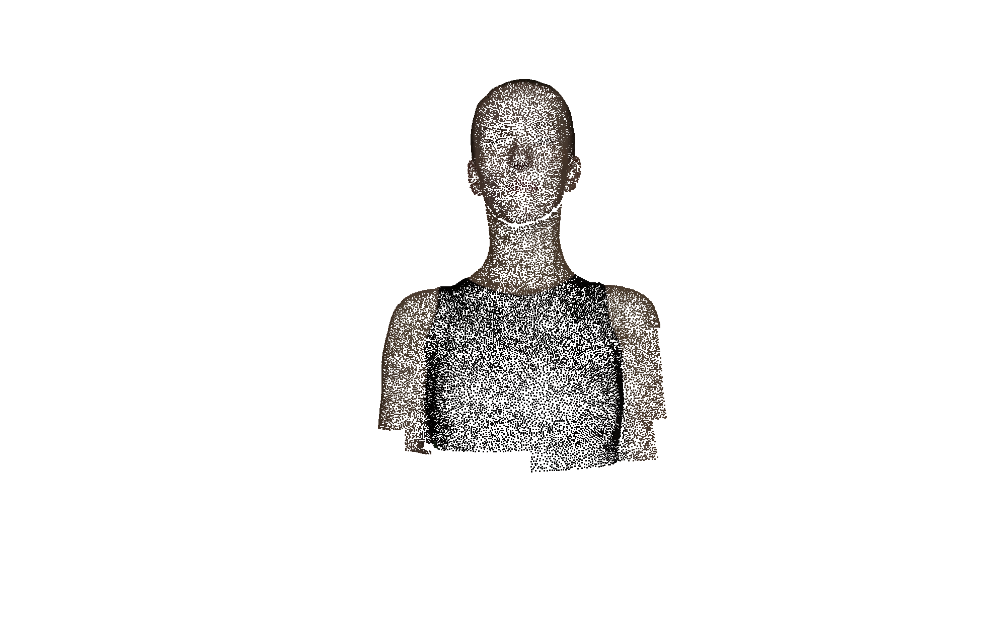
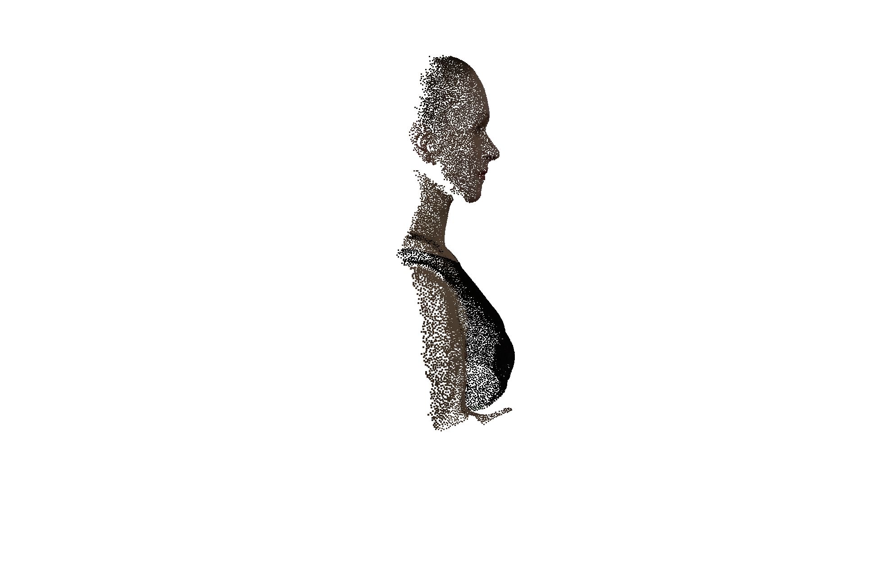
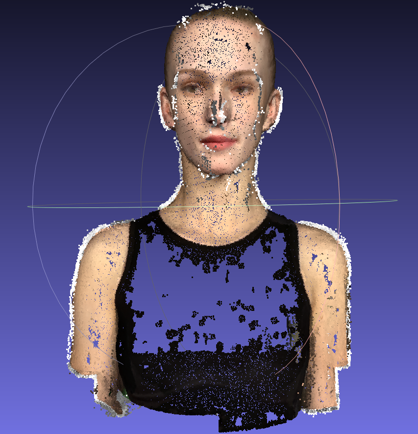
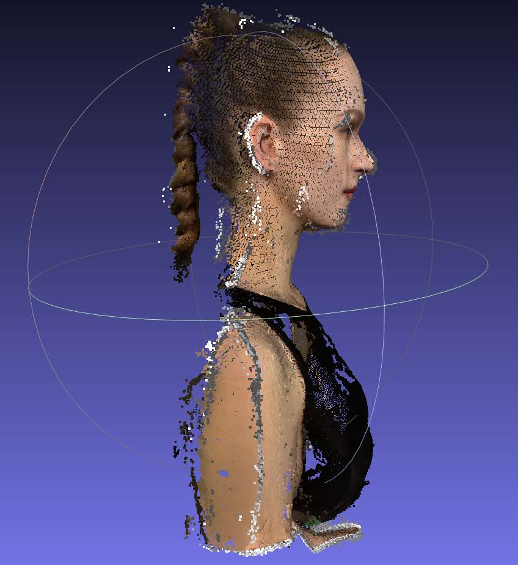

# Assignment 3 - Bundle Adjustment & 3D Reconstruction

## This repository is HeJiaxuan's implementation of Assignment_03 of DIP.

---

### 1. Bundle Adjustment with PyTorch

从 2D 观测出发，使用 PyTorch 优化 20000 个 3D 点坐标、50 组相机外参（旋转+平移）以及共享焦距，最小化重投影误差。

## Running

```bash
python bundle_adjustment.py
```

## Results

**Loss 曲线（对数坐标）:**



**重建的 3D 点云（带颜色 OBJ 文件，MeshLab 渲染）:**





**输出文件:**
| 文件 | 说明 |
|------|------|
| `results/points3d.npy` | 优化后的 20000 个 3D 点坐标 |
| `results/euler_angles.npy` | 50 组相机 Euler 角 |
| `results/translations.npy` | 50 组相机平移向量 |
| `results/focal_length.npy` | 优化后的焦距 |
| `results/reconstructed_pointcloud.obj` | 带颜色 3D 点云 (OBJ 格式) |
| `results/camera_params.txt` | 相机参数文本文件 |

---

### 2. 3D Reconstruction with COLMAP

使用 COLMAP 命令行工具对 50 张多视角渲染图像进行完整的三维重建，包括特征提取、匹配、稀疏重建、稠密重建。

## Running

**完整重建（特征提取 → 稠密重建）：**
```bash
python run_colmap.py
```

## Results

**稠密重建点云 (fused.ply)：**





**输出文件:**
| 文件 | 说明 |
|------|------|
| `data/colmap/sparse/0/` | 稀疏重建结果（相机位姿、稀疏点云） |
| `data/colmap/dense/fused.ply` | 稠密重建点云 |

---

### Requirements:

```setup
python -m pip install -r requirements.txt
```
