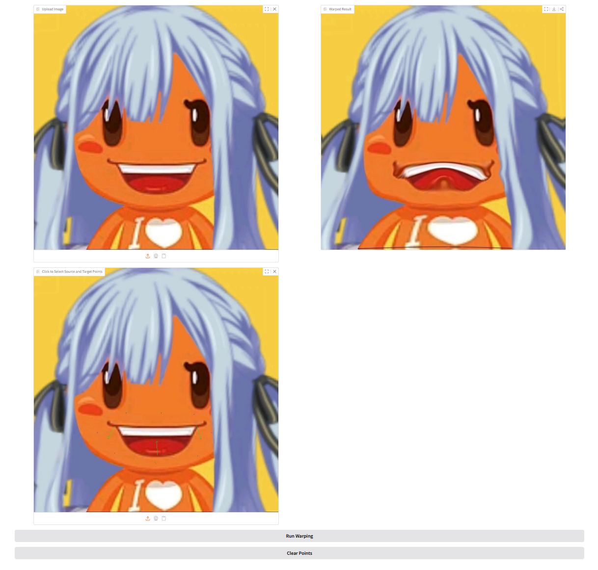

# Assignment 1 - Image Warping

## Implementation of Image Geometric Transformation

This repository is HeJiaxuan's implementation of Assignment_01 of DIP. 


## Requirements

To install requirements:

```setup
python -m pip install -r requirements.txt
```


## Running

To run basic transformation, run:

```basic
python run_global_transform.py
```

To run point guided transformation, run:

```point
python run_point_transform.py
```

## Results 
### Basic Transformation


### Point Guided Deformation:



